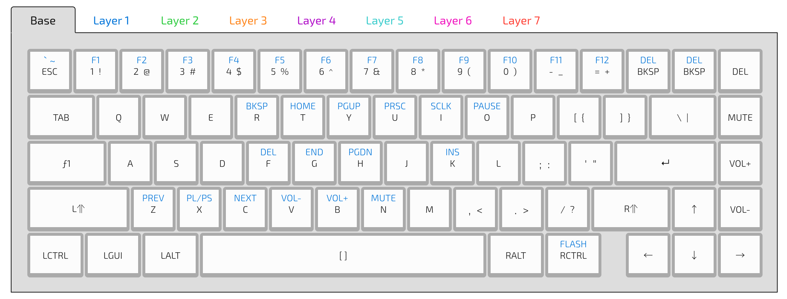

# Keyboard configuration
My configuration for the [WhiteFox](https://input.club/whitefox) keyboard

## Usage
1. Import the [layout](whitefox.json) into the [WhiteFox configurator](https://input.club/configurator-whitefox)
2. Flash the firmware onto the keyboard using [dfu-util](https://github.com/kiibohd/controller/blob/master/Documentation/Keyboards/WhiteFox.md)
